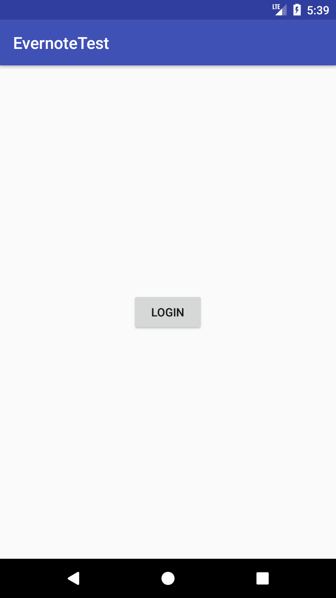
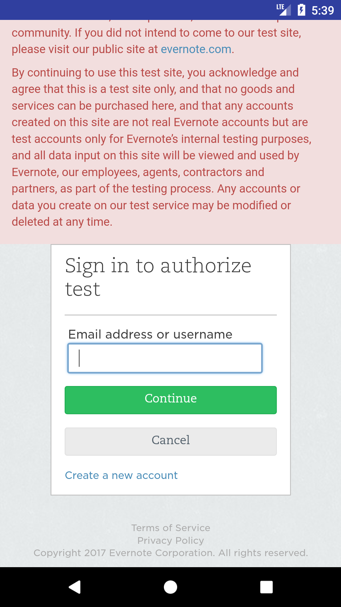
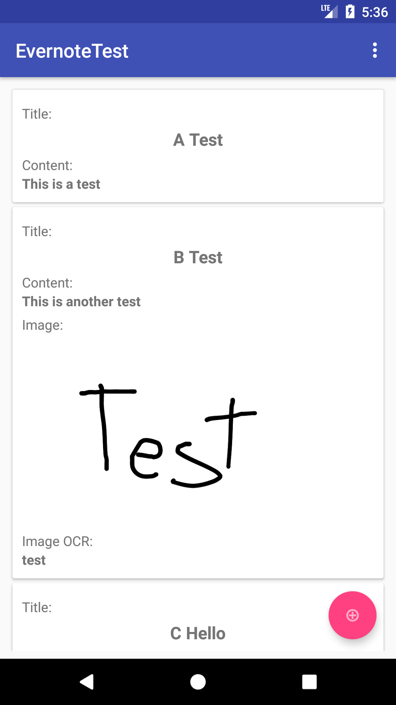
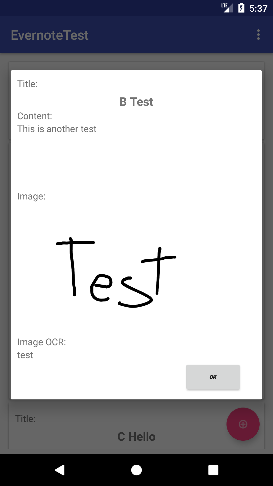
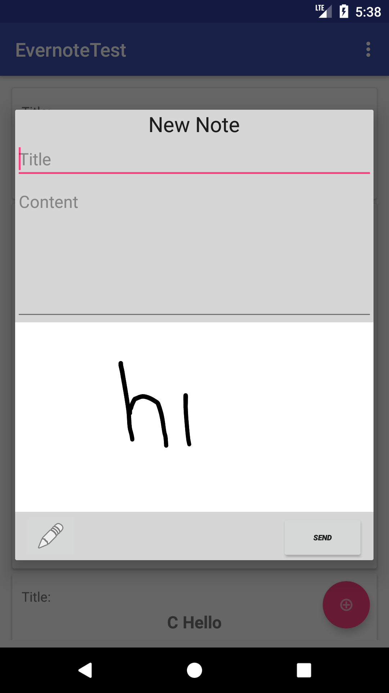
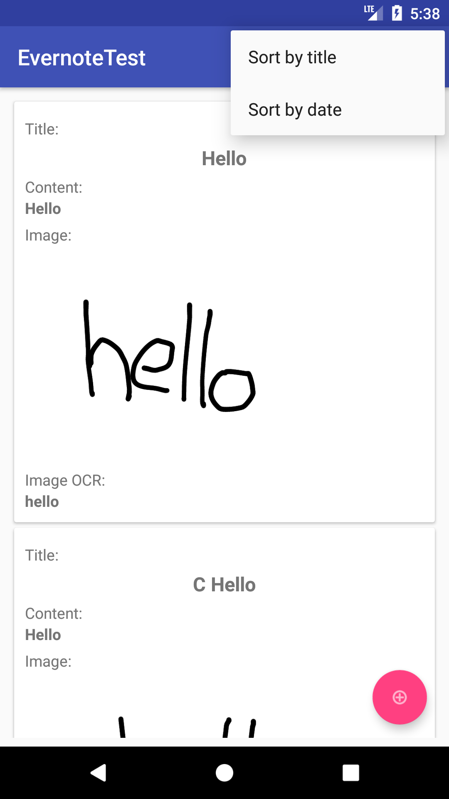

# PruebaAndroidEvernote
Prueba Técnica Android Carlos Sánchez.

Esta prueba consiste en una aplicación cliente de Evernote. La app permite mostrar las notas creadas por el usuario, así como crear nuevas notas de texto o utilizando la pantalla del dispositivo para escribir y subir la imagen resultante. De las imágenes subidas en las notas se mostrará también el resultado del OCR ejecutado.

## Imágenes

             

También se ha creado un vídeo que muestra el funcionamiento de la aplicación
https://github.com/kleiren/PruebaAndroidEvernote/blob/dev/evernoteTest.mp4


## Configuración
Para que la aplicación funcione, es necesario disponer de las claves de desarrollador para el API de Evernote y de una cuenta en su sandbox.   
Para obtener las claves (son necesarias claves full access) hay que crear una cuenta en esta web:  
https://dev.evernote.com/doc/  
Y una vez dispones de las claves, crear una cuenta en el servidor de desarrollo:  
https://sandbox.evernote.com/Registration.action  

Las claves hay que introducirlas en el archivo "App.java", en los campos de:
```
    private static final String CONSUMER_KEY = "key"; // This should be a valid one if not, the app will crash!
    private static final String CONSUMER_SECRET = "secret"; // This should be a valid one
```
## Documentación del desarrollo

Además de estas explicaciones, los archivos están comentados en diversas partes para explicar qué y cómo realiza la aplicación sus distintos procesos y funcionalidades.

La aplicación es muy básica, por lo que no dispone de casi detección de errores, ordenación de recursos, interfaces decentes etc. Con más tiempo se podría profundizar en cada uno de esos campos así como  investigar mejores opciones de descarga de los archivos del API de evernote, y mejor gestión de las notas descargadas.

### Login
Después de acceder correctamente a la API, utilizando el EvernoteSession.Builder con credenciales válidos desde "App.java", para el acceso a la aplicación, es necesario en primer lugar una actividad de login.
El api de evernote dispone de una manera sencilla de realizarlo a través de EvernoteSession.getInstance().authenticate(), lo que permite acceder a un webview del entorno web de desarrollo para introducir el nombre y contraseña del usuario actual.


### Lista de notas
Una vez se ha completado correctamente el login a la aplicación, se accede a la actividad principal de la aplicación. Esta actividad contiene los distintos fragmentos de la aplicación.    
Al entrar, se inicia el fragment "NoteListFragment", que mostrará todas las notas creadas por el usuario en un recyclerview.    
Para la obtención de las notas, primero, a través de un "EvernoteNoteStoreClient", se obtendrá la lista de notebooks del usuario. Una vez obtenida, se obtendrá la lista de notas del primer (el por defecto) notebook. Esta aplicación no está preparada para mostrar más de un cuaderno, pero sería sencillo ampliarla para permitir esa funcionalidad. El proceso de obtención de notebooks se podría realizar de forma más ordenada utilizando un observable o un sistema similar al igual que se hace más adelante la obtención de información de cada nota.   

Una vez se dispone de todas las notas, es necesario obtener su contenido, ya que evernote no permite recopilarlas todas de golpe. Para ello, se crea un "ObservableNoteList", un observable que permite obtener los datos de las notas (contenido, imágen y ocr de la imagen) de forma asíncrona y que irá actualizándose con el contenido descargado del servidor, permitiendo a este fragmento ("NoteListFragment") subscribirse al observable e ir actualizando su recyclerview con la información descargada.  
Para facilitar la transferencia de información dentro de la app, se ha utilizado un objeto "SimpleNote" que almacena la información necesaria de cada nota.

Desde la vista de notas se pueden ordenar utilizando el menú desplegable por título y por fecha. Para ello se utiliza el Collections.sort de java.

### Creación y muestra de notas
Para crear una nota, se utiliza el Floating action button de la actividad principal. Este mostrará un diálogo con los campos para introducir un título y el contenido de la nota. Además, permitirá crear una nota manuscrita con un botón que muestra un lápiz. 

Para la creación de la nota manuscrita se ha utilzado la librería https://github.com/simplifycom/ink-android

Es una librería sencilla que permite dibujar sobre la pantalla y exportar el dibujo como un bitmap. Esto se podría haber implementado sin necesidad de librería de terceros, pero por simplicidad se ha integrado esta librería.

Una vez se ha completado la nota, el contenido se prepara para crear un objeto Note de Evernote. Se obtiene el mimetype de la imagen y se incluye en un Resource, y se incluyen los textos del título y del contenido en el formato de evernote. 
Con este objeto Note se realiza una llamada a la api de forma asíncrona, que subirá la nota al servidor.
Una vez se haya completado el proceso, se volverá a la lista de notas principal, actualizando su contenido con la nota subida.
La nota subida probablemente no muestre aún el resultado del ocr de su imagen, ya que los servidores de evernote tardan un tiempo en procesar las imágenes.


Para mostrar las notas, al pulsar en cualquier nota de la lista se mostrará en su propio diálogo.


### OCR de las imágenes
Evernote permite descargar un resultado del ocr de la imágenes subidas contenido en su objeto Note. El problema se encuentra en que el resultado que se obtiene del ocr es un array de datos con el formato xml de evernote. Dentro de este xml se encuentran las posibles palabras encontradas con varios resultados para cada palabra ordenados con un valor de probabilidad. 

Para poder representar el resultado del ocr en pantalla, se ha creado un parser utilizando XmlPullParser. El parser es muy básico, y de cada resultado obtiene únicamente la palabra con mayor probabilidad de cada una de las palabras detectadas, devolviendolo como un string.

### Resto de funcionalidades
Los archivos están comentados en diversas partes para explicar qué y cómo realiza la aplicación sus distintos procesos y funcionalidades que puede que no esten descritos en este documento.


